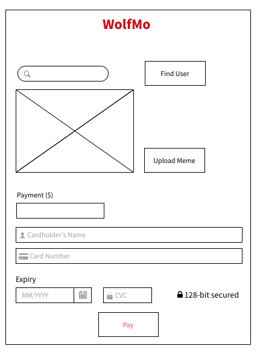

# HW2

This homework will provide practice with essential technology for building a webpage, with a focus on layout and composition.

**The assignment is due Sunday, Sept 12th, before midnight**.

## Github Repository Setup

A github repository has been created for you hosted on Github Enterprise. Sign into [NCSU's GitHub](https://github.ncsu.edu/).

Confirm your submission repository exists: `https://github.ncsu.edu/CSC-WebApps-F21/HW2-<unity>-WebApps`

## HW2 Content

### Conceptual Questions

### WolfMo

Incorporate the following elements into the implementation of your payment service:

* A search user function.
* An upload file function.
* An payment form.
* A node.js application providing functionality REST endpoints.
* After clicking `Pay`, redirect to submission page showing information received by server.

### Screencast

Create a screencast of for your assignment. In your screencast, cover the following:

> Describe your payment form and demonstrate your payment in action.

For guidelines, software, and recommendations [see Screencasts](Screencasts.md).

## Evaluation and Submission

You will be graded for completing the following tasks and meeting the following criteria:

* [ ] Conceptual Questions (20)
* [ ] Wolfmo Front-end (30)
* [ ] Wolfmo REST services (30)
* [ ] Page Aesthetics and Quality of Implementation (10) 
* [ ] Screencast (10)

**The assignment is due Sunday, Sept 12th, before midnight**.

Provide your answers to the conceptual questions in the README.md. Include your source files in your main repository branch. Document any information relevant for teaching staff that can be used to assist evaluated your site, and include a link to your screencast in the README.md.

To submit your work, commit and push all changes to your repository by the deadline.