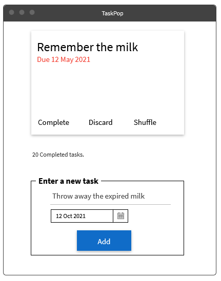

# HW3

This homework will provide practice with essential technology for dynamically updating a webpage, with a focus on understanding javascript and DOM.

**The assignment is due Sunday, Oct 3rd, before midnight**.

## Class exercise

## Implement application in two frameworks.

Pick two `{angular,vue, react}` frameworks, and implement two versions of *TaskPop*, a simple todo application, using one of the frameworks.

### TaskPop

`TaskPop` allows you to store a set of tasks---but only displays one task at a time. This limitation allows you to be reminded of a task without being overwhelmed by the size of your todo list.

TaskPop works as the following:

* Add task(s) with a short task description and due date.
* If any task exists, one is randomly selected and displayed in the task card area.
* **Complete**: Mark a task complete, remove from list, and update number of completed tasks.
* **Discard**: Delete task from list. The number of completed tasks is not updated.
* **Shuffle**: Replace task with another random task in list.

> Note: You may simply store information on the client-side (in memory) without a back-end.

### Frameworks comparison

1. Compare your two applications. Which framework did you find easier to work with? Why?

2. How does using a framework compare to using vanilla javascript or jQuery? How does a framework help (or not help)?

3.  For each framework, describe an interesting challenge you encountered when implementing your app? What was the issue and how did you solve it?

### Screencast

Create a screencast of your assignment. In your screencast, cover the following:

> Briefly describe your two implementations of your application and demonstrate your implementations in action.

For guidelines, software, and recommendations [see Screencasts](Screencasts.md).

## Evaluation and Submission

You will be graded for completing the following tasks and meeting the following criteria:

* [ ] Class exercise (20)
* [ ] TaskPop.A (30)
* [ ] TaskPop.B (30)
* [ ] Frameworks Comparison (10)
* [ ] Screencast (10)

Ensure you have two seperate directories for your two different applications, e.g. `HW4/Taskpop.vue/` and `HW4/Taskpop.angular`.

Provide your answers to the conceptual questions in the README.md. Include your source files in your main repository branch. Document any information relevant for teaching staff that can be used to assist evaluated your submission, and include a link to your screencast in the README.md.

To submit your work, commit and push all changes to your repository by the deadline.

